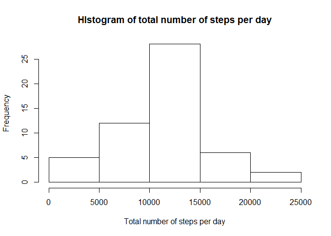
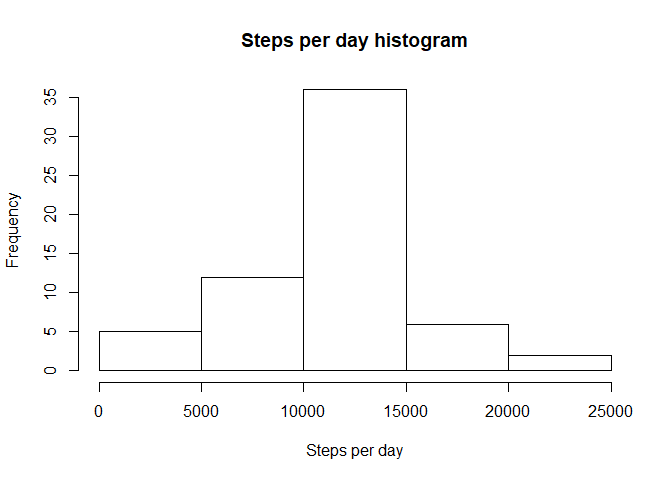
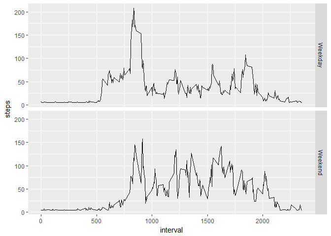

# Reproducible Research: Peer Assessment 1


## Loading and preprocessing the data

Libraries are loaded. The data is read and formatted for easy manipulation.


```r
library(ggplot2)
setwd("C:/Users/kiiiiibble/Desktop/Coursera - R Programming")
data<-read.csv("activity.csv")
data$date<-as.Date(data$date, format="%Y-%m-%d")
```

## What is mean total number of steps taken per day?

1. Get number of steps/day

```r
daystep<-aggregate(steps~date, data, sum)
```

2. Histogram

```r
hist(daystep$steps, main="HIstogram of total number of steps per day", xlab="Total number of steps per day")
```

<!-- -->

3. Mean and Median

```r
mean(daystep$steps, na.rm=TRUE)
```

```
## [1] 10766.19
```

```r
median(daystep$steps, na.rm=TRUE)
```

```
## [1] 10765
```

## What is the average daily activity pattern?

1. Get number of steps/interval

```r
intstep<-aggregate(steps~interval, data, mean, na.rm=TRUE)
```

2. Make time series plot

```r
ggplot(intstep, aes(interval, steps))+geom_line()
```

<!-- -->

3. Get max interval

```r
intstep[intstep$steps==max(intstep$steps),]
```

```
##     interval    steps
## 104      835 206.1698
```

## Imputing missing values

1. Number of NA

```r
sum(is.na(data$steps))
```

```
## [1] 2304
```

2. Put mean of steps in NA.

```r
data2<-data
data2$steps[is.na(data2$steps)]<-mean(data2$steps, na.rm=T)
ag2<-aggregate(steps~date, data2, sum)
hist(ag2$steps, main="Steps per day histogram", xlab="Steps per day")
```

<!-- -->

3. New steps mean and median

```r
mean(ag2$steps)
```

```
## [1] 10766.19
```

```r
median(ag2$steps)
```

```
## [1] 10766.19
```

3b. Old steps mean and median

```r
mean(daystep$steps)
```

```
## [1] 10766.19
```

```r
median(daystep$steps)
```

```
## [1] 10765
```

Mean and median are more or less the same as the old.

## Are there differences in activity patterns between weekdays and weekends?

1. Make weekdays factor

```r
data2$date<-as.Date(data2$date, format="%Y-%m-%d")
data2$weekdays<-weekdays(data2$date)
for(i in 1:nrow(data2)){
        if(data2$weekdays[i]=="Saturday" || data2$weekdays[i]=="Sunday"){
                data2$weekdays[i]<-"Weekend"
        }
        else{
                data2$weekdays[i]<-"Weekday"
        }
}
```

2. Plot intervals vs. steps

```r
finaldata<-aggregate(steps~interval + weekdays, data=data2, mean)

ggx<-ggplot(finaldata, aes(interval, steps))+facet_grid(weekdays~.)+geom_line()
ggx
```

<!-- -->
